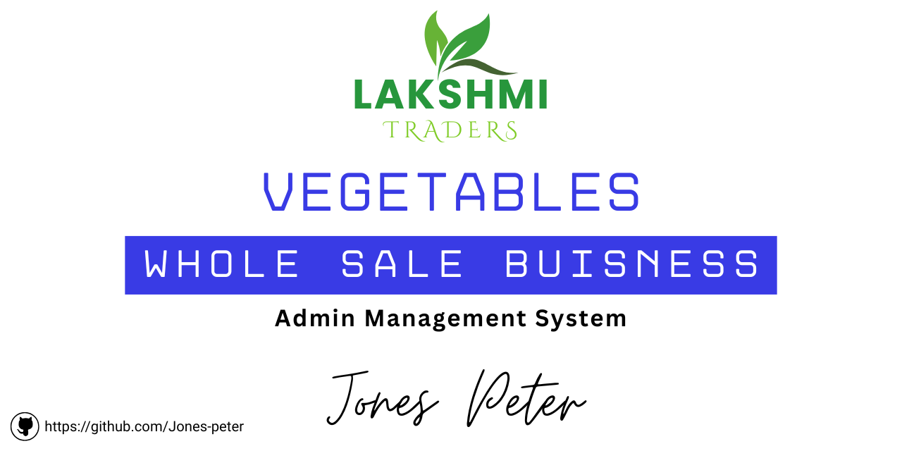

# Lakshmi Traders - Vegetable Wholesale Management



[](https://github.com/Jones-peter)  [](https://www.instagram.com/jones_peter__/)  [](https://www.linkedin.com/in/jones-peter-121157221/)  [](https://jonespeter.site)

This is a Next.js application built with Firebase, designed to help Lakshmi Traders manage their vegetable wholesale business efficiently.

## Key Features:

*   **Batch Management:** Track incoming vegetable batches, including details like vegetable type, purchase date, quantity, and cost.
*   **Customer Management:** Maintain a database of customers with their contact information and purchase history.
*   **Sales Tracking:** Record sales transactions, link them to specific batches and customers, and manage payment statuses.
*   **Reporting & Analytics:** Generate reports on revenue, outstanding payments, and sales performance.
*   **User Authentication:** Secure login for administrators.

## Getting Started

This project is built with Next.js and Firebase, utilizing ShadCN UI components for a modern and responsive user interface.

To get started with the project:

1.  **Clone the repository:**
    ```bash
    git clone <repository_url>
    cd lakshmi-traders-app
    ```

2.  **Install dependencies:**
    ```bash
    npm install
    # or
    yarn install
    ```

3.  **Set up Firebase:**
    *   Create a Firebase project at [console.firebase.google.com](https://console.firebase.google.com/).
    *   Enable Firestore Database and Firebase Authentication (Email/Password).
    *   Get your Firebase project configuration (apiKey, authDomain, etc.).
    *   Update the Firebase configuration in `src/lib/firebase/config.ts` with your project's credentials.

4.  **Run the development server:**
    ```bash
    npm run dev
    # or
    yarn dev
    ```
    The application will be available at `http://localhost:9002`.

## Main Technologies Used

*   **Next.js (App Router)**: For the frontend framework and routing.
*   **React**: For building user interfaces.
*   **TypeScript**: For static typing.
*   **Firebase**: For backend services (Authentication, Firestore Database).
*   **ShadCN UI**: For pre-built, accessible UI components.
*   **Tailwind CSS**: For utility-first styling.
*   **Lucide React**: For icons.
*   **Recharts**: For data visualization (charts).
*   **React Hook Form & Zod**: For form handling and validation.

## Project Structure

*   `src/app/`: Contains the main application pages using Next.js App Router.
    *   `(authenticated)`: Route group for pages requiring authentication.
        *   `dashboard/`: Dashboard overview.
        *   `batches/`: Batch management pages.
        *   `customers/`: Customer management pages.
        *   `reports/`: Reporting and analytics.
        *   `settings/`: User settings.
    *   `login/`: Login page.
    *   `layout.tsx`: Root layout for the application.
    *   `page.tsx`: Main entry point, handles redirection based on auth status.
*   `src/components/`: Reusable UI components.
    *   `dashboard/`: Components specific to the dashboard.
    *   `batches/`: Components for batch management (forms, columns).
    *   `customers/`: Components for customer management (forms, columns).
    *   `sales/`: Components for sales management (forms, columns).
    *   `layout/`: Layout components like Header, Sidebar.
    *   `ui/`: ShadCN UI components.
*   `src/contexts/`: React Context providers (e.g., AuthContext).
*   `src/hooks/`: Custom React hooks (e.g., `useAuth`, `useToast`).
*   `src/lib/`:
    *   `firebase/`: Firebase configuration and service functions (auth, firestore).
    *   `schemas.ts`: Zod schemas for data validation.
    *   `utils.ts`: Utility functions.
*   `src/types/`: TypeScript type definitions.
*   `public/`: Static assets like images.

## Available Scripts

In the project directory, you can run:

*   `npm run dev` or `yarn dev`: Runs the app in development mode.
*   `npm run build` or `yarn build`: Builds the app for production.
*   `npm run start` or `yarn start`: Starts the production server.
*   `npm run lint` or `yarn lint`: Lints the code.
*   `npm run typecheck` or `yarn typecheck`: Checks TypeScript types.

This project aims to provide a robust and user-friendly platform for Lakshmi Traders to streamline their wholesale operations.
